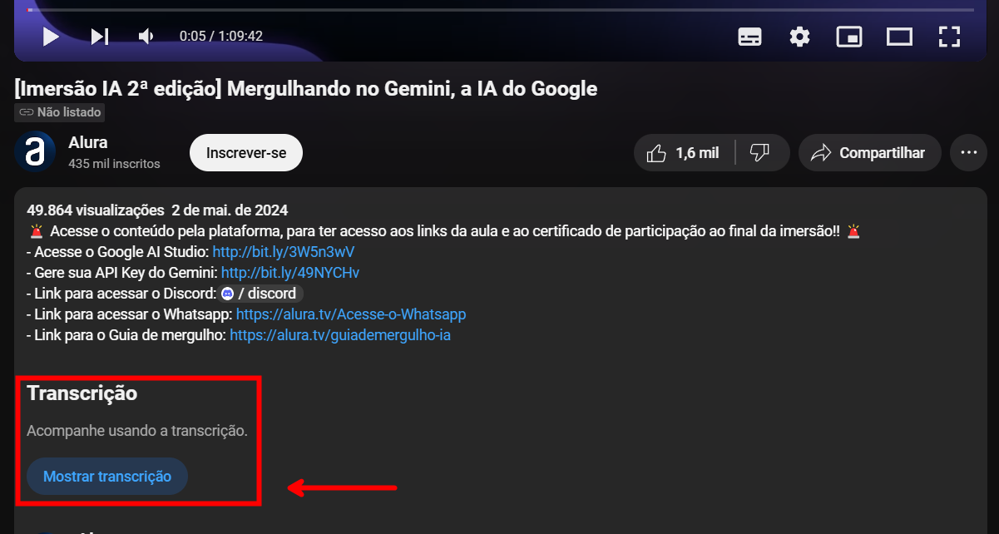

Esse resumo foi criado com suporte do Google AI Studio.

Copie o diálogo do video https://www.youtube.com/watch?v=1TQp_g2ScGg&t=5s

Cole no AI Studio e peça para resumir, trazer os links citados, os testes com o Gemini, as sugestões de cenários para testar o Gemini, os desafios propostos, os próximos passos e o ponto mais importante da aula.

## Resumo da Aula Inaugural da Imersão de IA

A aula inaugural da Imersão de IA, uma parceria entre a Alura e o Google, apresentou o modelo de linguagem generativo Gemini e a plataforma Google AI Studio. Paulo Silveira, CEO da Alura, e Fabrício Carraro, Program Manager da Alura, conversaram com Luciano Martins, Developer Advocate do Google, sobre as possibilidades dessas ferramentas para profissionais de diversas áreas, incluindo marketing, finanças e programação.

Durante a aula, foram demonstradas as capacidades do Gemini em gerar textos criativos, como poemas e scripts para sites, além de interpretar e analisar sentimentos em reviews de hotéis. Também foi apresentado o Google AI Studio, um ambiente para desenvolvimento e experimentação com modelos de IA, incluindo o Gemini.

## Links citados:

- Gemini[https://gemini.google.com/]
- Google AI Studio[https://aistudio.google.com/]
- Google Cloud Innovators[https://cloud.google.com/innovators]
- Comunidade da Alura no Discord[https://discord.gg/Dw6zBZAFU9]
- Kaggle[https://www.kaggle.com/]
- Codepen[https://codepen.io/pen/]

## Testes com o Gemini demonstrados na aula:

- Geração de texto: criação de um poema para uma agência de viagens, um texto de marketing para o Japão e ideias para vídeos curtos sobre programação front-end.
- Análise de sentimento: avaliação de reviews de hotéis e atribuição de notas de 1 a 5 de acordo com o sentimento expresso.
- Geração de código: criação de código HTML, CSS e JavaScript para um site de uma agência de viagens.
- Interpretação de imagens: descrição de uma imagem do Paulo Silveira em um estacionamento, identificando elementos como o carro, as malas, a roupa e o ambiente.
- Tradução: tradução da transcrição de uma carta escrita à mão em inglês para o português.

## Sugestões de outros possíveis cenários para testar o Gemini

## Criação de conteúdo:

- Roteiros de vídeos: gerar roteiros para vídeos do YouTube, TikTok ou Instagram, incluindo sugestões de diálogos, transições e música.
- Posts para redes sociais: criar posts para Facebook, LinkedIn ou Twitter, com textos e hashtags relevantes para o público-alvo.
- E-mails de marketing: gerar e-mails de marketing personalizados para diferentes segmentos de clientes.
Artigos de blog: escrever artigos de blog sobre diversos temas, com informações precisas e um estilo envolvente.

## Análise de dados:

- Resumir relatórios financeiros: extrair as informações mais importantes de relatórios financeiros extensos.
- Analisar dados de pesquisas de mercado: identificar tendências e insights a partir de dados de pesquisas quantitativas e qualitativas.
- Classificar e-mails de suporte: categorizar e-mails de suporte de acordo com o tipo de problema e o nível de urgência.

## Programação:

- Gerar testes unitários: criar testes unitários para código em diferentes linguagens de programação.
- Refatorar código: sugerir melhorias no código para torná-lo mais eficiente e legível.
- Traduzir código: traduzir código de uma linguagem de programação para outra.
- Explicar trechos de código: fornecer explicações claras e concisas sobre o funcionamento de trechos de código complexos.

## Outras possibilidades:

- Criar legendas para vídeos: gerar legendas automáticas para vídeos em diferentes idiomas.
- Resumir textos longos: extrair as principais ideias de textos longos, como artigos científicos ou documentos jurídicos.
- Criar apresentações: gerar slides para apresentações, com textos, imagens e gráficos relevantes.
- Lembre-se de que essas são apenas algumas sugestões, e as possibilidades de uso do Gemini são vastas e dependem da sua criatividade e das suas necessidades específicas.

## Desafios propostos:

Desafio 1:

Utilizar a plataforma do gemini.google.com ou o aistudio.google.com para realizar uma tarefa do seu dia a dia de trabalho, independentemente da sua área de atuação. Exemplos:

- Marketing: Gerar ideias para campanhas, criar textos para anúncios ou posts em redes sociais.
- Finanças: Analisar dados financeiros, resumir relatórios ou criar previsões.
- Advocacia: Resumir contratos, identificar cláusulas importantes ou gerar minutas de documentos.
- Programação: Gerar código, criar testes unitários ou explicar trechos de código complexos.

Desafio 2:

- Exportar seu histórico de navegação para uma planilha.
- Utilizar o Gemini para analisar essa planilha e gerar um resumo dos sites mais acessados, classificando-os por tipo (entretenimento, trabalho, etc.) e quantidade de uso.
- Refletir sobre as conclusões e como você tem utilizado seu tempo online.

Compartilhe seus resultados!

Poste seus resultados nas redes sociais com as hashtags #Alura, #ImersaoIA e #Google.

## Próximos passos:

Aprofundar o conhecimento sobre o Gemini e o Google AI Studio nas próximas aulas da imersão.
Participar da comunidade da Alura no Discord para tirar dúvidas e trocar ideias com outros participantes.
Assistir a todas as aulas na plataforma da Alura para obter o certificado da imersão.
Participar do desafio que será lançado na aula 4 e concorrer a prêmios.

## Ponto mais importante da aula:

O ponto mais importante da Aula 1 é a demonstração do potencial transformador da IA generativa e de ferramentas como o Gemini e o Google AI Studio para profissionais de diversas áreas. A aula deixa claro que a IA não é mais uma tecnologia do futuro, mas sim uma realidade presente que pode ser utilizada para aumentar a produtividade, gerar insights, automatizar tarefas e, consequentemente, transformar a maneira como trabalhamos.