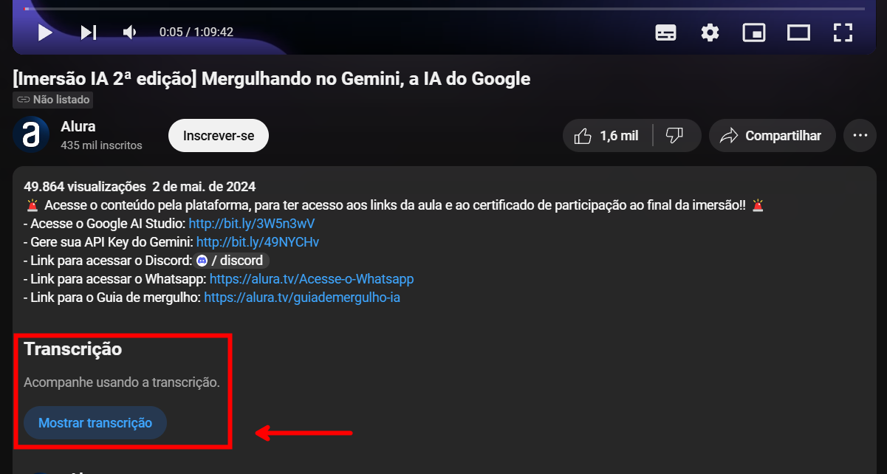

Esse resumo foi criado com suporte do Google AI Studio.

Copie o diálogo do video https://www.youtube.com/watch?v=U0U78uwGtLQ

Cole no AI Studio e peça para resumir, trazer os links citados, os testes com o Gemini, as sugestões de cenários para testar o Gemini, os desafios propostos, os próximos passos e o ponto mais importante da aula.

## Resumo da segunda aula da imersão de IA:

Nesta aula, Paulo Silveira da Alura, Luciano do Google e Fabrício da Alura discutem o conceito de engenharia de prompt e como usá-lo para otimizar os resultados do Google AI Studio com o Gemini. Eles enfatizam a importância de instruções claras e específicas ao fazer prompts, usando exemplos de viagens ao Japão e programação. Diversas técnicas de prompt são apresentadas, incluindo Zero-Shot, Few-Shot e Chain-of-Thought, com exemplos práticos de como aplicá-las para tradução, classificação de e-mails e resolução de problemas matemáticos. 

A aula também aborda a questão das alucinações em modelos de linguagem e as medidas de segurança implementadas pelo Google para mitigá-las. Os participantes são incentivados a experimentar diferentes técnicas de prompt usando conteúdo público e a se juntar à comunidade de Innovators do Google e ao Discord da Imersão IA para mais informações e interação. Os links mencionados na aula são:

- Google AI Studio: aistudio.google.com
- Comunidade de Innovators do Google: cloud.google.com.br/innovators
- Paper "Language Models are Few-Shot Learners": https://arxiv.org/abs/2005.14165
- Paper "Chain of Thoughts Prompting Elicits Reasoning in Large Language Models": https://arxiv.org/abs/2201.11903

## Testes de Prompt Engineering na aula:

Viagem ao Japão:
    Prompt inicial (pouco específico): "Crie uma campanha de viagem para o Japão." 
    Resultado: Resposta ampla e genérica, sem foco em público-alvo ou objetivos específicos.
    Prompt melhorado (mais específico): "Aja como um agente de marketing. Crie uma campanha de viagem para o Japão focada em brasileiros que se interessam pela cultura de artes marciais e samurais. Liste os principais pontos turísticos que os viajantes irão visitar no Japão que tenham relação com esses temas. Seja específico, dia a dia, pois será um itinerário de 5 dias."
    Resultado: Resposta muito mais direcionada e detalhada, com foco em artes marciais, samurais e um itinerário de 5 dias.

Código em TypeScript: 
    Prompt inicial (pouco específico): "Escreva um código que calcula a sequência de Fibonacci."
    Resultado: Código em Python sem explicações.
    Prompt melhorado (mais específico): "Escreva uma função TypeScript para calcular com eficiência a sequência de Fibonacci. Crie comentários no código para explicar o que cada parte faz e por que foi escrita dessa forma." 
    Resultado: Código em TypeScript com comentários explicativos.

Tradução Inglês-Português:
    Prompt com Few-Shot: Exemplos de frases em inglês e português para ensinar o modelo a traduzir.
    Resultado: Tradução precisa da frase em inglês para o português.

Criação de Exercícios de Português:
    Prompt com Few-Shot e Chain-of-Thought: Exemplos de palavras em inglês com tradução para o português e exercícios criados com essas palavras.
    Resultado: O modelo gerou novos exercícios com base nas novas palavras fornecidas. 

Cálculo de Imposto de Renda:
    Prompt com Few-Shot e Chain-of-Thought: Explicação passo a passo de como calcular o imposto de renda com base em um conjunto de exemplos. 
    Resultado: O modelo calculou corretamente o imposto a ser arrecadado com base em uma lista de rendimentos.

## Sugestões de prompts para uso no dia a dia:

Marketing:
- Gerar ideias para campanhas: "Aja como um especialista em marketing e gere 5 ideias criativas para uma campanha de lançamento de um novo produto [nome do produto] focado em [público-alvo]."
- Criar textos para anúncios: "Escreva um texto persuasivo para um anúncio de mídia social promovendo [produto/serviço] e destacando [benefícios]."
- Analisar sentimento do cliente: "Analise os seguintes comentários de clientes e identifique o sentimento geral (positivo, negativo ou neutro): [lista de comentários]."

Educação:
- Criar planos de aula: "Crie um plano de aula para o ensino de [tópico] para alunos do [nível escolar], incluindo objetivos de aprendizagem, atividades e materiais."
- Gerar perguntas de avaliação: "Crie 10 perguntas de múltipla escolha para avaliar a compreensão dos alunos sobre [tópico]."
- Adaptar material para diferentes níveis de aprendizado: "Simplifique o seguinte texto para torná-lo compreensível para alunos do [nível escolar]: [texto]."

Escrita criativa:
- Gerar ideias para histórias: "Crie uma ideia para uma história de ficção científica com os seguintes elementos: [lista de elementos]."
- Escrever diferentes tipos de conteúdo: "Escreva um poema sobre [tema] no estilo de [poeta famoso]."
- Continuar uma história: "Continue a seguinte história: [texto da história]."

Programação:
- Gerar código em diferentes linguagens: "Escreva uma função em Python que [descrição da função]."
- Explicar trechos de código: "Explique o que o seguinte código faz: [código]."
- Encontrar erros no código: "Identifique possíveis erros no seguinte código: [código]."

Dados e análise:
- Analisar dados e encontrar tendências: "Analise os seguintes dados de vendas e identifique as principais tendências: [dados]."
- Criar visualizações de dados: "Crie um gráfico de barras que mostre a distribuição de [variável] nos seguintes dados: [dados]."
- Gerar relatórios: "Escreva um relatório resumindo as principais descobertas da análise dos seguintes dados: [dados]."

Lembre-se de que essas são apenas sugestões e você pode adaptar os prompts para atender às suas necessidades específicas. O importante é experimentar e descobrir o que funciona melhor para você.

## Desafios propostos:

Desafio 1

Usar a técnica Few-Shot com Chain-of-Thought para resolver um problema da vida real em sua área de atuação.

Desafio 2

Usar a técnica Few-Shot com Chain-of-Thought para analisar títulos de notícias de um site favorito e pedir ao Gemini para sugerir um título para uma nova notícia.

## Próximos passos:

- Aula 3: Explorar os parâmetros do Google AI Studio e como eles afetam os resultados do Gemini.
- Aula 4: Aprender a usar a API do Gemini para automatizar tarefas.

## Ponto mais importante da aula:

A qualidade do prompt é fundamental para obter resultados precisos e relevantes do Gemini. Aprender e aplicar técnicas de engenharia de prompt permite que você aproveite ao máximo o potencial do modelo de linguagem.

